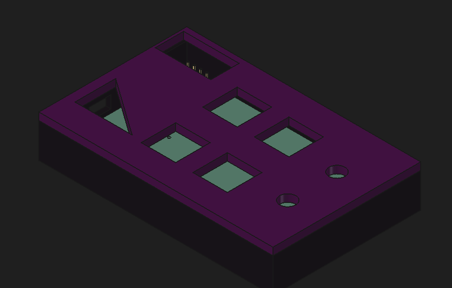
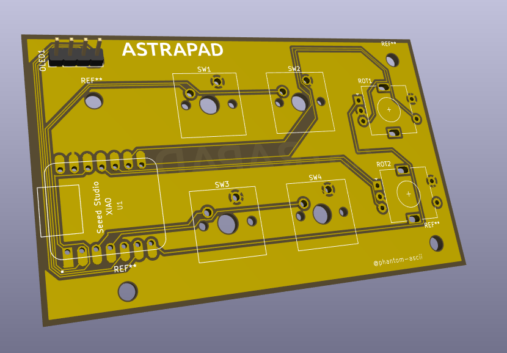
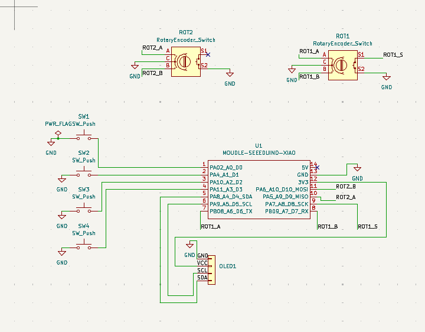
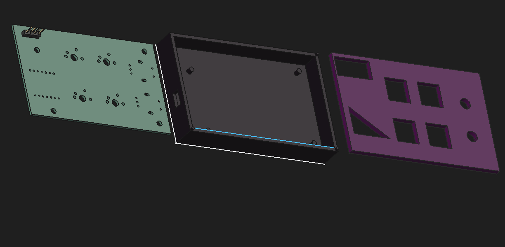

# ✦ AstraPad

> A tiny macropad for a very specific Linux problem.

**Stardance:** https://stardance.hackclub.com/@phantom-ascii/

---

## What is AstraPad?

If you've used the Linux terminal, you've probably noticed that `Ctrl + C` and `Ctrl + V` don't work like they do everywhere else.

Instead:

- `Ctrl + Shift + C` → Copy
- `Ctrl + Shift + V` → Paste

It's not a massive problem, but when you're using the terminal constantly, reaching for that extra `Shift` gets annoying.

So I decided to build a little hardware solution.

**AstraPad** is a custom 4-key macropad designed around Linux terminal shortcuts, with two rotary encoders and an OLED display.

### Features

- 4 programmable shortcut keys
- 2 rotary encoders
- OLED status display
- Seeed XIAO RP2040
- Custom PCB
- Custom 3D-printed case
- Volume and mute control
- Brightness control
- Custom KMK firmware

---

## Keymap

| Control | Function |
|---|---|
| SW1 | `Ctrl + Shift + C` |
| SW2 | `Ctrl + Shift + V` |
| SW3 | `Ctrl + C` |
| SW4 | `Ctrl + V` |
| ROT1 clockwise | Volume up |
| ROT1 counter-clockwise | Volume down |
| ROT1 press | Mute |
| ROT2 clockwise | Brightness up |
| ROT2 counter-clockwise | Brightness down |

The planned OLED behaviour is to display the current volume or brightness while it is being adjusted, then turn off after 1 second of inactivity.

---

## Hardware

### PCB

The PCB was designed and routed from scratch in **KiCad**.

The board is designed around:

- Seeed XIAO RP2040
- 4 direct-wired switches
- 2 rotary encoders
- I²C OLED
- USB-C
- Custom PCB mounting points

The PCB has been through a KiCad DRC with **0 unconnected pads**.

### Schematic

The schematic contains the electrical design and pin assignments for AstraPad.

### Pinout

#### Switches

| Component | XIAO Pin |
|---|---|
| SW1 | D0 |
| SW2 | D1 |
| SW3 | D2 |
| SW4 | D3 |

#### OLED

| Signal | XIAO Pin |
|---|---|
| SDA | D4 |
| SCL | D5 |

#### ROT1

| Signal | XIAO Pin |
|---|---|
| A | D6 |
| B | D7 |
| Push | D8 |

#### ROT2

| Signal | XIAO Pin |
|---|---|
| A | D9 |
| B | D10 |

ROT2 does not have a push switch.

---

## Case

The case was designed from scratch in **FreeCAD**.

It consists of:

- Top lid
- Bottom tray
- Custom PCB mounting pillars
- USB-C access
- OLED opening
- Switch openings
- Rotary encoder openings

The PCB sits directly inside the bottom tray using custom-designed mounting pillars.

### Exploded View

The exploded view shows how the PCB and case fit together.

The case was designed around the PCB rather than being an afterthought.

---

## Project Files

The repository contains the source files required to reproduce the design.

### PCB

The repository contains:

- KiCad project files
- KiCad schematic
- KiCad PCB layout
- Gerbers

### CAD

The repository contains:

- FreeCAD `.FCStd` source files
- Master assembly
- `.STEP` assembly
- Top case
- Bottom case

### Firmware

Firmware is being developed using **KMK** and **CircuitPython**.

The firmware is currently a work in progress and will be tested once the XIAO RP2040 arrives.

---

## Bill of Materials

See [`BOM.csv`](./BOM.csv) for the current bill of materials and project requirements.

The Hackpad Kit provides the main electronic components used by AstraPad.

Additional requirements include PCB manufacturing and a soldering iron.

---

## Building It

I'm designing everything from scratch using **KiCad** and **FreeCAD**, then writing the firmware with the help of AI.

This is my first proper PCB project, so things will probably break.

That's part of it.

I've already had to redesign parts of the PCB after realising that I had the USB-C connector facing the wrong direction.

Turns out designing hardware is slightly less forgiving than writing HTML.

---

## Progress

### Design

- [x] Schematic
- [x] PCB layout
- [x] PCB DRC
- [x] Case design
- [x] PCB mounting
- [x] USB-C case opening
- [x] Gerbers
- [x] KiCad source files
- [x] FreeCAD source files
- [x] Master STEP assembly
- [x] BOM
- [x] GitHub repository
- [x] Initial firmware

### Remaining

- [ ] Finish firmware
- [ ] Sanity check
- [ ] Order parts
- [ ] Assemble
- [ ] First power-on
- [ ] Test keys, encoders and OLED
- [ ] Final build
- [ ] Ship

---

## Devlog

I'm documenting the build and the problems I run into on Stardance.

**Devlog:**  
https://stardance.hackclub.com/@phantom-ascii/

The build hasn't exactly gone smoothly.

I've already had to redesign the PCB after discovering that the USB-C connector was facing into the PCB instead of out through the case.

But that's kind of the point.

I'm learning by actually building something.

---

## About

Made by `phantom-ascii`

14yo learning Linux, hardware, PCB design and embedded development.

Trying to turn annoying little problems into actual things.

---

## Status

🟡 **Building**

The hardware design is complete.

AstraPad is now moving into firmware, manufacturing, assembly and testing.
